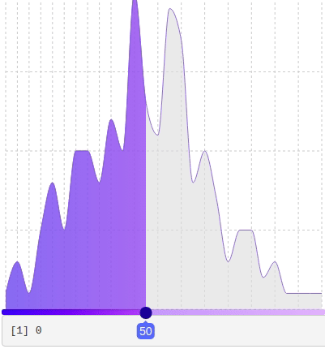

<!-- badges: start -->
<!-- badges: end -->

# reactslider

Such a slider would be great for Shiny, it seems however that [react-slider-kit](https://github.com/M-Izadmehr/react-slider-kit) might not be it.

:warning: This is a work in progress.

``` r
# install.packages("remotes")
remotes::install_github("JohnCoene/reactslider")
```

## Example

``` r
library(shiny)
library(reactslider)

x <- round(rnorm(200, 50, 5))

ui <- fluidPage(
  reactsliderInput("slider", data = x),
  verbatimTextOutput("text")
)

server <- function(input, output) {
  output$text <- renderPrint({
    input$slider
  })
}

shinyApp(ui, server)
```


